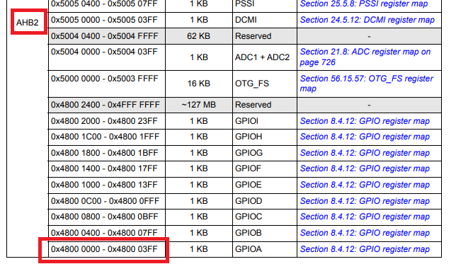
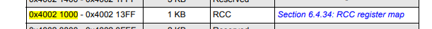
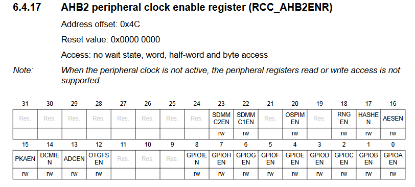
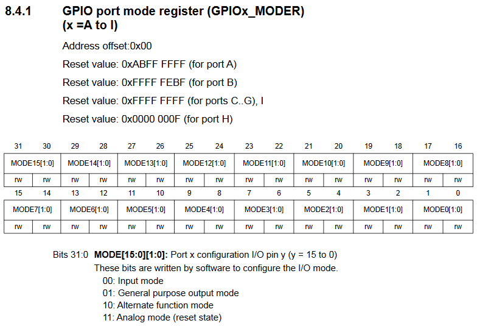
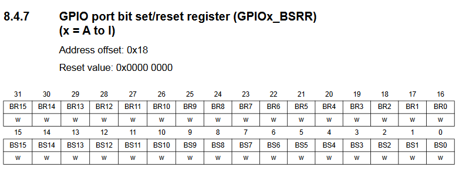
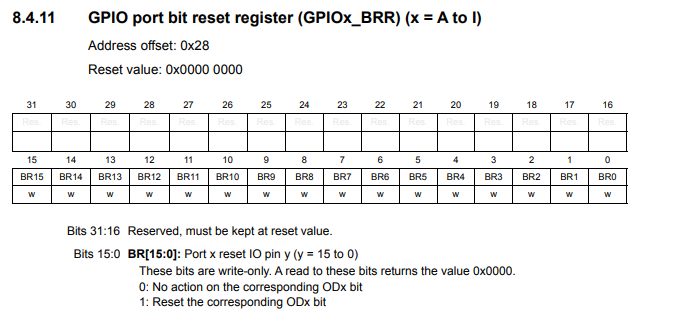
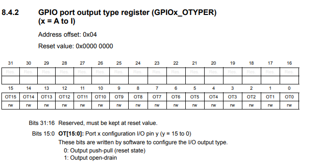
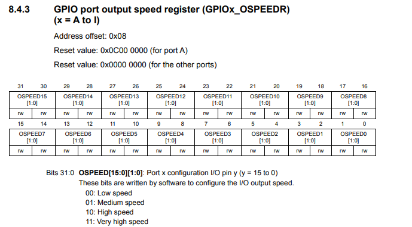
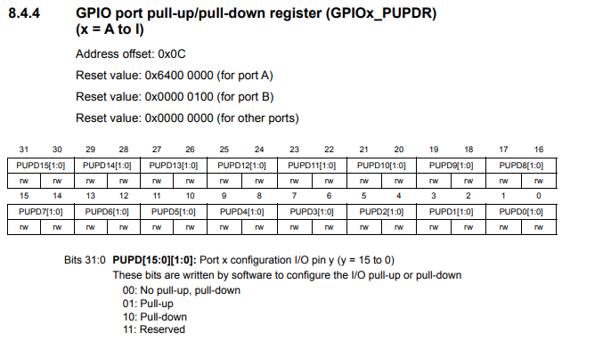
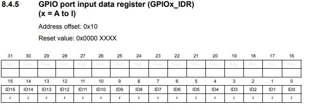

# General purpose input output
### Output
#### Step 1 : Configure the clock

- Enable the peripheral clock for GPIOX Port (where x is A or B or C etc). The peripheral clock for GPIOX (AHB2) can be found in the following figure.



- Find the address of the `RCC_AHB2ENR` register [RCC_BASE_ADDRESS + RCC_AHB2ENR_OFFSET] (0x40021000 + 0x4C)

```sh
#define RCC_BASE_ADDRESS 0x40021000 // Look at the RCC regiser map
#define RCC_AHB2ENR_OFFSET 0x4C
#define RCC_AHB1ENR (*((volatile uint32_t*) (RCC_BASE_ADDRESS + RCC_AHB2ENR_OFFSET)))
```




- Example, If we set `PA0` as output pin then 0th bit of the register (RCC_AHB2ENR) should be set to `1`.
```sh
RCC_AHB2ENR = RCC_AHB2ENR | (1 << 0);
```

#### Step 2 : Configure pin as output  


- `GPIOx_MODER` is used to configure the pin as output and we have to write `01` to the specific bit as shown in the following figure.



- Find the address of the GPIOx regiser [GPIOx_BASE + GPIOx_MODE_OFFSET] where x = A, B ..... I
- Example, if we configure `PA0` as output. we have to find the base address of `GPIOA` (ref: GPIO register map) + offset of the mode register (`0x00`)

```sh
#define  GPIOA_BASE_ADDRESS  0x48000000
#define GPIOx_MODER_OFFSET 0x00
#define GPIOA_MODER (*((volatile uint32_t*) (GPIOA_BASE_ADDRESS + GPIOx_MODER_OFFSET)))
```

- Set `01` in `GPIOA_MODER` (`MODE[1:0]` ) register.


```sh
 GPIOA_MODER = GPIOA_MODER | (1 << 0);  
 GPIOA_MODER = GPIOA_MODER &  ~(1 << 1);   
```

#### Step 3 : Set the pin
- To set the pin GPIOX_BSRR register is used.
- Find the address of the GPIOx_BSRR regiser [GPIOx_BASE_ADDRESS + GPIO_BSRR_OFFSET] where x = A, B ..... I

```sh
#define  GPIOA_BASE_ADDRESS  0x48000000
#define GPIO_BSRR_OFFSET 0x18
#define GPIOA_BSRR (*((volatile uint32_t*) (GPIOA_BASE_ADDRESS + GPIO_BSRR_OFFSET)))
```

-  Example,To set PA0, 0th bit of the register (GPIOx_BSRR) should be set to 1.




  ```sh
 GPIOA_BSRR = 1;
```

#### Step 4 : Clear the pin
- To clear the pin GPIOX_BRR register is used.
- Find the address of the GPIOx_BRR regiser [GPIOx_BASE_ADDRESS + GPIO_BSRR_OFFSET] where x = A, B ..... I

```sh
#define  GPIOA_BASE_ADDRESS  0x48000000
#define GPIO_BRR_OFFSET 0x28
#define GPIOA_BRR (*((volatile uint32_t*) (GPIOA_BASE_ADDRESS + GPIO_BRR_OFFSET)))
```

-  Example,To set PA0, 0th bit of the register (GPIOx_BRR) should be set to 1.




  ```sh
 GPIOA_B2RR = 1;
```
### Input
#### Step 1 : Configure the clock

- Enable the peripheral clock for GPIOX Port (where x is A or B or C etc). The peripheral clock for GPIOX (AHB2) can be found in the following figure.


- Find the address of the RCC_AHB2ENR register [RCC_BASE_ADDRESS + RCC_AHB2ENR_OFFSET] (0x40021000 + 0x4C)

```sh
#define RCC_BASE_ADDRESS 0x40021000 // Look at the RCC regiser map
#define RCC_AHB2ENR_OFFSET 0x4C
#define RCC_AHB1ENR (*((volatile uint32_t*) (RCC_BASE_ADDRESS + RCC_AHB2ENR_OFFSET)))
```


- Example, If we set PA0 as input pin then 0th bit of the register (RCC_AHB2ENR) should be set to 1.
```sh
RCC_AHB2ENR = RCC_AHB2ENR | (1 << 0);
```

#### Step 2 : Configure pin as input
- To set the pin as input mode GPIOx_MODER registers is used. The register adress offsets and reset values are in the following table

- Find the address of the GPIOx regiser [GPIOx_BASE + GPIOx_OFFSET] where x = A, B ..... I
- For examble if the pin is PA0 then

```sh
#define  GPIOA_BASE_ADDRESS//  0x48000000
#define GPIOx_MODER_OFFSET// 0x00
#define GPIOA_MODER (*((volatile uint32_t*) (GPIOA_BASE_ADDRESS + GPIOx_MODER_OFFSET)))
```


- The bit is set
- From the below digram it is known that input mode is set according to the pin number of the pin which we use as input. 
- Example if PA0 is set as input pin, then 0th bit (0 + 0) and 1st bit(0 + 0 + 1) should be set as input mode.


```sh
 GPIOA_MODER = GPIOA_MODER | (1 << (pin_number + pin_number));
 GPIOA_MODER = GPIOA_MODER &  ~(1 << (pin_number + pin_number + 1)); 
```

- To configure the pin as input GPIOx_MODER registers is used
- Find the address of the GPIOx_OTYPER regiser [GPIOx_BASE + GPIOx_OTYPER_OFFSET] where x = A, B ..... I
- For examble if the pin is PA0 then
- 
```sh
#define  GPIOA_BASE_ADDRESS//  0x48000000
#define GPIO_OTYPER_OFFSET//   0x04
#define GPIOF_OTYPER (*((volatile uint32_t*)(GPIOA_BASE_ADDRESS + GPIO_OTYPER_OFFSET)))
```
- In GPIOx_OTYPER register the output open_drain mode is set according to the pin number of the pin which we use as input, which can be  seen in he below figure.
- 
 

- Example if PA0 is set as input pin,  then 0th bit of the register (GPIOx_OTYPER) should be set to 1.
- 
```sh
     GPIOF_OTYPER = GPIOF_OTYPER | (1 << 0);
```

- To configure the pin as input GPIOx_OSPEEDR register is used
- Find the address of the GPIOx_OSPEEDR regiser [GPIOx_BASE + GPIOx_OSPEEDR_OFFSET] where x = A, B ..... I
- For examble if the pin is PA0 then
- 
```sh
#define  GPIOA_BASE_ADDRESS//  0x48000000
#define GPIO_SPEEDR_OFFSET// 0x08
#define GPIOF_OTYPER (*((volatile uint32_t*)(GPIOA_BASE_ADDRESS + GPIO_OSPEEDR_OFFSET)))
```
- In GPIOx_OSPEEDR register the very high speed is set according to the pin number of the pin which we used as input.
- - Example if PA0 is set as input pin, then 0th bit (0 + 0) and 1st bit(0 + 0 + 1) should be set as Very high speed(11) mode, which can be seen in the below figure.
- 
 

```sh
 GPIO_SPEEDR = GPIO_SPEEDR | ( 1 << (0 + 0));
 GPIO_SPEEDR = GPIO_SPEEDR | ( 1 << ( 0 + 0 + 1));
```
- To configure the pin as input, GPIOx_PUPDR register is used
- Find the address of the GPIOx_PUPDR regiser [GPIOx_BASE + GPIOx_PUPDR_OFFSET] where x = A, B ..... I
- For examble if the pin is PA0 then
- 
```sh
#define  GPIOA_BASE_ADDRESS//  0x48000000
#define GPIO_PUPDR_OFFSET// 0x0c
#define GPIOF_PUPDR (*((volatile uint32_t*)(GPIOA_BASE_ADDRESS + GPIO_PUPDR_OFFSET)))
```
- In GPIOx_PUPDR register pull up mode is set according to the pin number of the pin which we used as input
- which acn be seen in the below figure.
- 


- - Example if PA0 is set as input pin, then 0th bit (0 + 0) and 1st bit(0 + 0 + 1) should be set as Very pull-up (01) mode, which can be seen in the below figure.
- 


```sh
 GPIO_PUPDR = GPIO_PUPDR | ( 1 << (0 + 0));
 GPIO_PUPDR = GPIO_PUPDR & ~ ( 1 << (0 + 0 + 1));
```
#### Step 3 : Read the pin

- To Read a pin GPIOF_IDR register is used.
- Find the address of the GPIOx_IDR regiser [GPIOx_BASE_ADDRESS + GPIO_IDR_OFFSET] where x = A, B ..... I
- For examble if the pin is PA0 then
```sh
#define  GPIOA_BASE_ADDRESS//  0x48000000
#define GPIO_IDR_OFFSET// 0x10 
#define GPIOA_IDR (*((volatile uint32_t*) (GPIOA_BASE_ADDRESS + GPIO_IDR_OFFSET)))
```
-  Example, To raed a pin PA0 then then 0th bit of tehe register should be checked whether it is 0 or 1, which can be seen in the following figure. 
-  


-  If it is 1, then the data is written.
-  If it is 0 , it should return nothing.
-  
```sh
  if (GPIOF_IDR & (1 << 0))
    {
        return 1;
    }
    else
    {
        return 0;
    }
```


