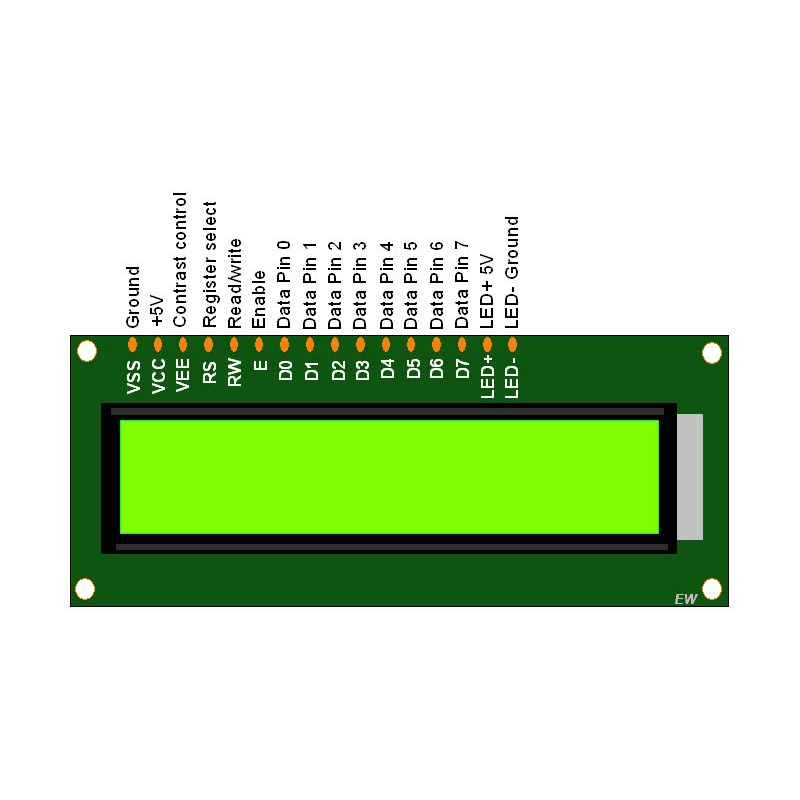

# 16x02 LCD
## LCD Pins

LCD pins should connected as below pins
| Lcd pin | Description |  Arduino-compatible headers |  Board Pins |
| ------ | :------: | ------: | ------: |
| VSS | Ground |
| VCC | +5V |
| VEE | Contrast control that should connect with potentiometer |
| RS | Register Connect | D8 | PF12 |
| R/W | Read/Write | GND | GND |
| Enable | Enable | D9 | PD15 |
| D7 | Data Pin | D7 | PF13 |
| D6 | Data Pin | D6 | PE9 |
| D5 | Data Pin | D5 | PE11 |
| D4 | Data Pin | D4 | PF14 |
| D3..D0 | Data Pin | - | - |

## LCD Commands
| LCD Command | Description |
| --- | ----------- |
| 0x0C | Dispaly ON |
| 0x28 | 4-bit mode |
| 0x01 | Clear the screen |
| 0x80 | Force cursor to beginning to first line |
| 0xC0 | Force cursor to beginning to second line |

## How does it work

We have used 4-bit mode
- Initialie the pis as output ()
- Send Command  
-- RS pin should be low  
-- Command should send as MSB (nibble), enable pulse (on and off), LSB (nibble) and enable pulse (on and off)  
- Send Data  
-- RS pin should be high  
-- Command should send as MSB (nibble), enable pulse (on and off), LSB (nibble) and enable pulse (on and off)  

